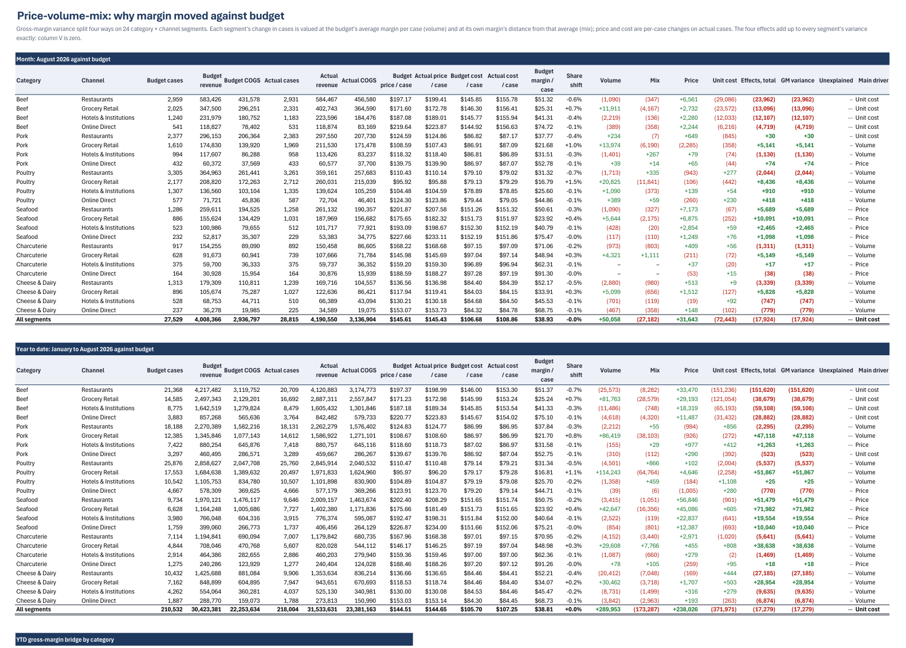
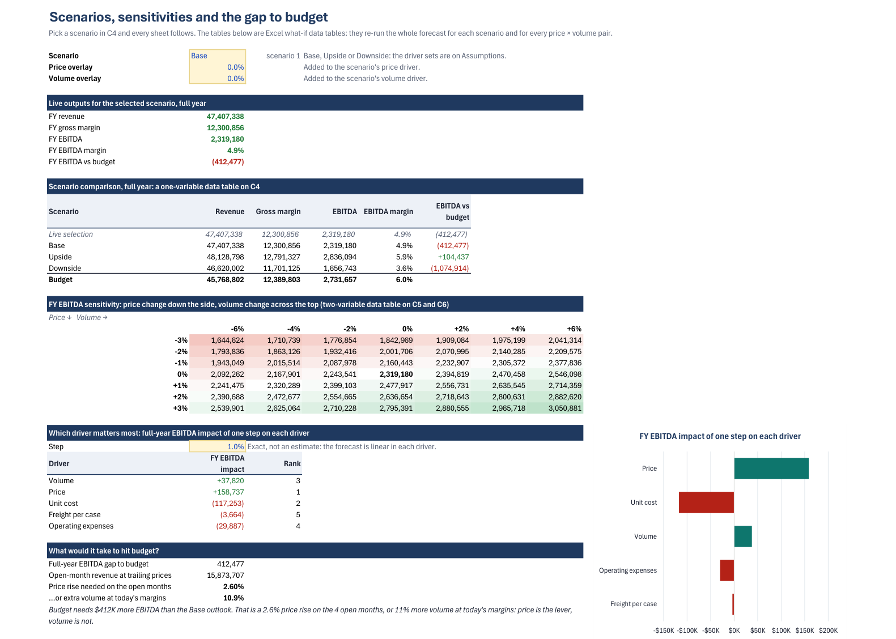
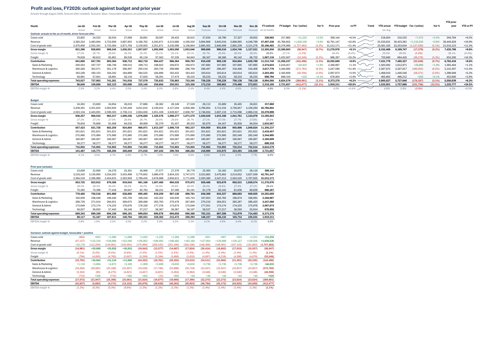
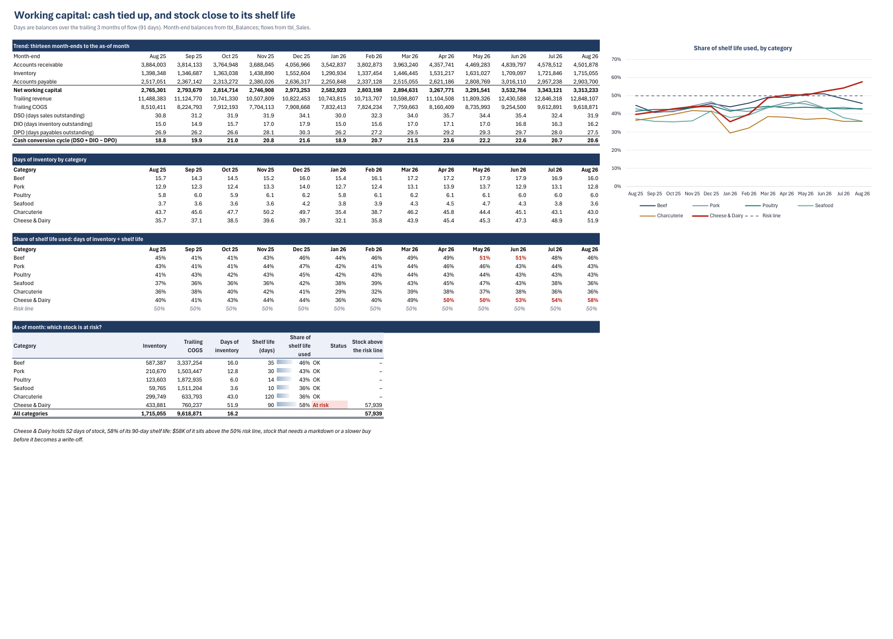
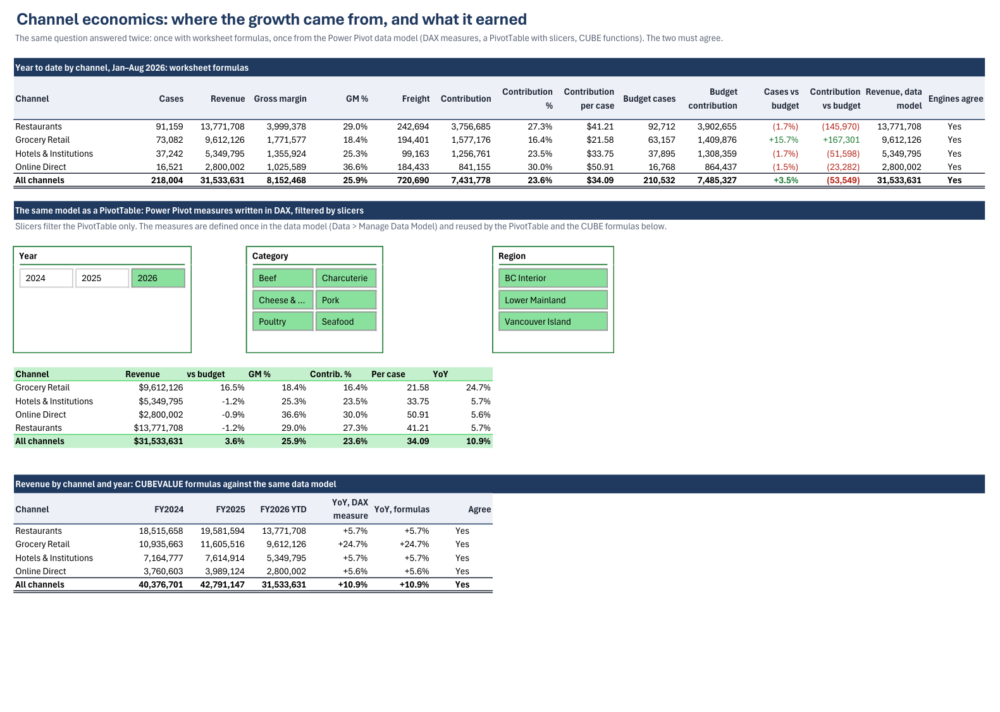
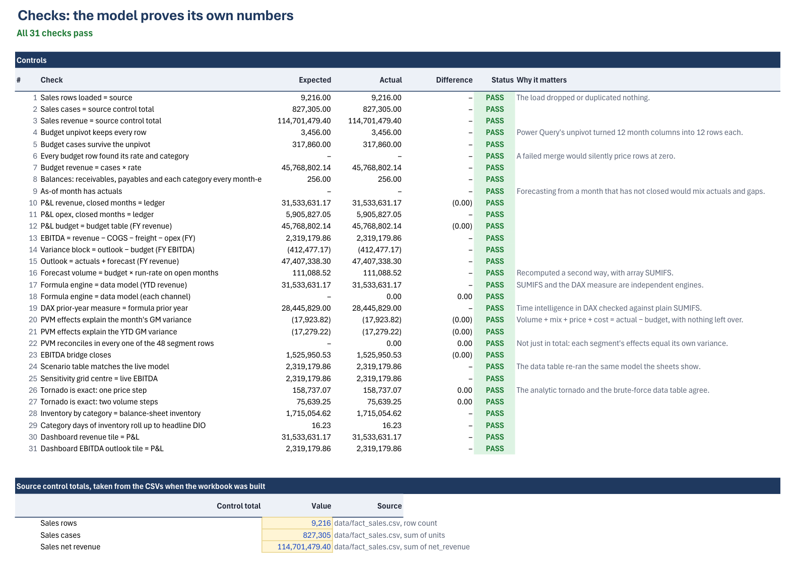

# Kestrel Bay Provisions: an FP&A model in Excel

[](https://github.com/KushPatel29/excel-fpa-model/actions/workflows/ci.yml)


A complete financial planning and analysis workbook for a fictional BC specialty-food
distributor. It covers budget against actual, a price-volume-mix bridge, an 8+4 driver
forecast, scenarios and sensitivities, working capital and channel economics. It is built
in Excel with Power Query, a Power Pivot data model with DAX measures, dynamic arrays,
named LAMBDA functions and what-if data tables.

Every number in the workbook is a live formula, and nothing is pasted in. 182 tests hold
the saved workbook to an independent pandas model to the cent.

**[Download the workbook](workbook/Kestrel_Bay_FPA_Model.xlsx)** (Microsoft 365 Excel) ·
**[Board pack PDF](docs/board_pack.pdf)** (11 pages, exported by Excel)


## What the model found

The data is synthetic but carries a story, and the workbook has to find it from the numbers.

**1. Revenue beat the budget; EBITDA did not.** Through August, revenue is **$31.5M, $1.11M
(+3.6%) ahead of budget**. EBITDA is **$1.53M, $232K (−13.2%) behind**. The growth has not
reached the bottom line.

**2. The price-volume-mix bridge shows why.** Year-to-date gross margin against budget:

| Effect | $ | What drove it |
|---|---:|---|
| Volume | **+$290K** | 3.5% more cases than budget |
| Price | **+$238K** | seafood (+$137K) and beef (+$92K) list prices |
| Mix | **−$173K** | the extra cases went to Grocery Retail: +15.7% on budget at **$21.58** contribution a case, against $41.21 in Restaurants and $50.91 online |
| Unit cost | **−$372K** | beef costs up 10% on last year since May, against 3% in the budget; Beef · Restaurants alone is −$151K |
| Freight | −$36K | BC Interior freight up 12% on last year, against 2% in the budget |
| Operating expenses | −$178K | Warehouse & Logistics 8% over budget |

**3. Where the year lands.** On the Base scenario, full-year EBITDA is **$2.32M against a
budget of $2.73M**, a gap of $412K. The range runs from $1.66M (Downside) to $2.84M (Upside).

**4. What closes the gap.** Either a **2.6% price rise** on the four open months, or **10.9% more
volume** at today's margins. The tornado shows why price is the realistic lever. One point on
each driver moves full-year EBITDA by:

| Price | Unit cost | Volume | Opex | Freight |
|---:|---:|---:|---:|---:|
| **+$159K** | −$117K | +$38K | −$30K | −$4K |

**5. Cash and stock.** The cash conversion cycle is 20.6 days. Cheese & Dairy holds **52 days of
stock, 58% of its 90-day shelf life**, and $58K of it sits above the 50% risk line. That stock
needs a markdown or a slower buy before it becomes a write-off.

**6. The budget itself.** At category-by-month grain the budget missed volume by a WAPE of 3.9%,
with a −3.4% bias: it under-called the year. For the open months, the driver forecast sits
1.7% below Excel's statistical `FORECAST.ETS` on the same history.

The Dashboard writes points 1 to 5 itself. The summary is a set of formulas (`LET`, `XMATCH`,
named `MONEY` and `SIGNMONEY` LAMBDAs), so switching the scenario or re-cutting the as-of month
rewrites the sentences. A test holds each sentence to the reference model.

## What's in the workbook

| Sheet | What it answers | Excel on show |
|---|---|---|
| **Cover** | Five questions answered live from the model, plus the sheet index and how-to | Hyperlinks, formula-driven answers |
| **Dashboard** | One page for a board: KPIs, bridges, scenarios, written summary | Waterfall, combo and stacked charts, sparklines, `SORTBY`, `LET` |
| **PnL** | Monthly P&L: outlook (actuals + forecast), budget, prior year, variance, YTD | `SUMIFS` on tables, `FAVVAR` / `SAFEDIV` / `ISCLOSED` LAMBDAs, conditional formatting |
| **PVM** | Price-volume-mix on 24 category × channel segments; margin and EBITDA bridges | Four-effect decomposition exact in every segment, `XMATCH` driver tags |
| **Forecast** | 8+4 driver forecast, budget accuracy, statistical cross-check | `XLOOKUP`, WAPE and bias, `FORECAST.ETS` |
| **Scenarios** | Base, upside and downside; price × volume grid; tornado; the gap to budget | What-if data tables (one- and two-variable), data validation, `SORTBY` + `HSTACK` |
| **WorkingCapital** | DSO, DIO, DPO and the cash cycle over 13 months; stock against shelf life | `DAYSOF` LAMBDA, trailing windows, data bars, risk flags |
| **Channels** | Channel economics, answered by formulas and by the data model, reconciled | Power Pivot + DAX (`TREATAS` time intelligence), PivotTable with slicers, `CUBEVALUE` |
| **Checks** | 31 controls that prove the model ties out | Reconciliations with a stated tolerance |
| **Assumptions** | Every input and scenario driver in one place | Named inputs, validation, blue-on-yellow input convention |
| **PQ_Budget** | The budget, unpivoted and priced | Power Query (M): unpivot, merges, typed columns |
| **Data_\*** | The source tables, loaded unchanged from the CSVs | Excel tables, structured references |

<table>
<tr><td></td><td></td></tr>
<tr><td></td><td></td></tr>
<tr><td></td><td></td></tr>
</table>

## How the pieces fit

```
data/*.csv ─► Excel tables (Data_*) ─┬─► Power Query ─► tbl_Budget (unpivoted, priced) ─┐
                                     │                                                  ├─► SUMIFS ─► PnL · PVM · Forecast · WorkingCapital
                                     │                                                  │                      │
                                     └─► Power Query ─► Power Pivot data model ──────────┤                 Scenarios (what-if data tables)
                                          (6 tables, 8 relationships, 13 DAX measures)   │                      │
                                                     └─► PivotTable + slicers, CUBEVALUE ┴──► Channels ──► Checks ─► Dashboard · Cover
```

The forecast is a driver model. For each category, the open months take budget cases
× the year-to-date volume run-rate, priced at the trailing three months' price, cost and
freight per case. Scenario drivers sit on top: volume, price, cost, freight and opex, each a
percentage on its base. Opex is budget × each department's year-to-date run-rate. Because
the model is linear in each driver, the tornado is exact, and a check proves it against the
brute-force data table.

The price-volume-mix values each segment's change in cases twice. At the budget's average
margin per case that change is **volume**; at the segment's own margin minus that average it
is **mix**. **Price** and **cost** are the per-case changes on actual cases. The four effects add
up to each segment's variance, not just to the total.

## How it's verified

- **An independent twin.** [`model/reference.py`](model/reference.py) recomputes every published
  figure in pandas from the same CSVs, without reading the workbook.
  [`tests/test_workbook_ties_out.py`](tests/test_workbook_ties_out.py) reads the saved workbook's
  cached values through defined names, so no test depends on a cell address. It holds each figure
  to the twin: every P&L line and month in all four blocks, the forecast blocks, all 48 PVM
  segment rows, both bridges, the scenario table, all 49 cells of the sensitivity grid, the
  tornado, the break-even, 13 months of working capital, and the channel economics.
- **Two engines, one answer.** The Channels sheet computes revenue by channel twice: with
  `SUMIFS`, and with `CUBEVALUE` against DAX measures in the data model. Year-on-year growth is
  computed the same two ways (`TREATAS` in DAX, and `SUMIFS`). The workbook checks that they
  agree, and so does the test suite.
- **31 in-workbook checks.** Load controls against source totals, Power Query row and case
  counts, P&L identities, bridge closure, and the data tables against the live model. Tests fail
  if any check fails, and if any cell in the workbook holds an error value.
- **No hard-coded numbers.** A test walks every calculation sheet and fails on any typed number.
  The only exceptions are the declared inputs and the data tables' axes.
- **The techniques are really there.** Feature tests open the `.xlsx` package itself. They unpack
  the Power Query M code from the DataMashup part and check the data model binary, the OLAP
  pivot cache and its measures, the three slicer caches, the waterfall chart part, both
  `dataTable` formulas, and the six named LAMBDAs.
- **Byte-reproducible data.** CI regenerates the dataset on Linux and fails if a single byte
  differs from the committed CSVs.
- **The tests can fail.** Shortening the reference model's trailing window by one month turns
  36 tie-out tests red.

### What the checks caught while building it

- **A price-volume-mix split that only added up in total.** The first build measured mix as
  the shift in each segment's share, valued against the average margin. That formulation sums
  to the variance for the whole business, but not segment by segment: in August, Beef ·
  Restaurants showed effects of −$17.5K against a variance of −$24.0K. The rebuild values each segment's change
  in cases at the average margin (volume) and at its own margin's distance from the average
  (mix). Totals are unchanged and every segment now reconciles. A check fails if any of the 48
  segment rows does not.
- **Cube formulas saved half-calculated.** `CUBEVALUE` evaluates asynchronously. Before the
  build waited for it, three checks read cube cells that had not finished calculating and
  failed. The build now waits for
  `CalculateUntilAsyncQueriesDone` before saving. A test fails on any `#GETTING_DATA` left in the
  file.

## Build it yourself

```bash
pip install -r requirements.txt
python generator/generate_data.py     # data/: seeded, byte-reproducible
python model/reference.py             # the pandas twin: bridge, scenarios, break-even, working capital
python -m pytest                      # any OS: holds the committed workbook to the twin
```

Rebuilding the workbook itself needs Windows with Microsoft 365 Excel and `pywin32`. It
takes about a minute and also exports the board pack:

```bash
python model/build_workbook.py        # workbook/Kestrel_Bay_FPA_Model.xlsx + docs/board_pack.pdf
python model/render_previews.py       # docs/img/*.png from the PDF (needs pymupdf, pillow)
```

The builder drives Excel over COM and runs in a private Excel process, so an Excel window you
already have open is left alone. Python only lays the workbook out. The arithmetic is Excel's:
formulas, Power Query, DAX and data tables.

## Using the workbook

1. **Pick a scenario** in `Scenarios!C4`. Every sheet, chart and sentence follows.
2. **Test your own view** with the price and volume overlays in `Scenarios!C5:C6`.
3. **Re-cut from an earlier close.** Change the as-of month on `Assumptions`, then use
   Data › Refresh All so the data model's calendar follows.
4. **Explore the data model** with the slicers on `Channels`.

## Repository layout

```
generator/generate_data.py   seeded synthetic data with a planted story
data/                        the CSVs the workbook is built from (+ manifest.json)
model/reference.py           independent pandas recomputation of every figure
model/build_*.py, xl.py      the COM builder: setup, calculation sheets, analysis, views
model/layout.py              names and positions shared by the builder and the tests
workbook/                    Kestrel_Bay_FPA_Model.xlsx
docs/                        board_pack.pdf and the README images
tests/                       182 tests: tie-out, features, data, badge
```

## Limits

- The company is fictional and the data synthetic, with the story planted on purpose so the
  analysis has something true to find.
- CI cannot run Excel. It verifies the committed workbook's cached values and the committed data,
  but it cannot rebuild the workbook.
- The DAX measures live inside the data model's binary. They are verified through what they
  produce (the PivotTable cache and the `CUBEVALUE` results), not by reading their text.
- The forecast is a driver model, not a fitted statistical one. `FORECAST.ETS` is a
  cross-check, not the forecast.

## License

MIT. Kestrel Bay Provisions is fictional; any resemblance to a real business is coincidental.
