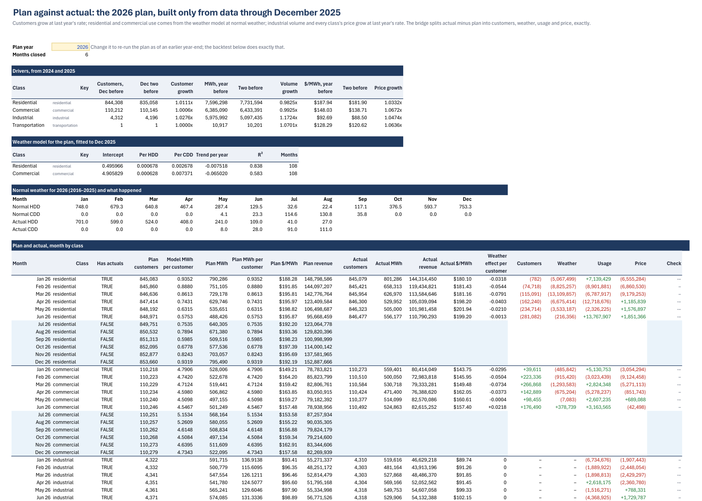
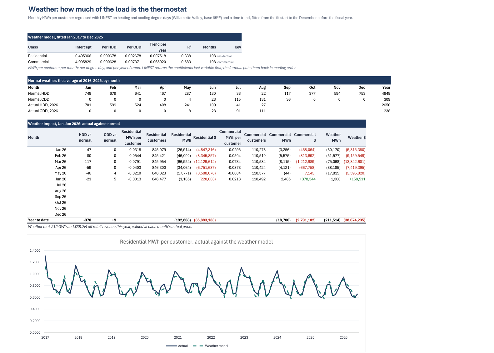
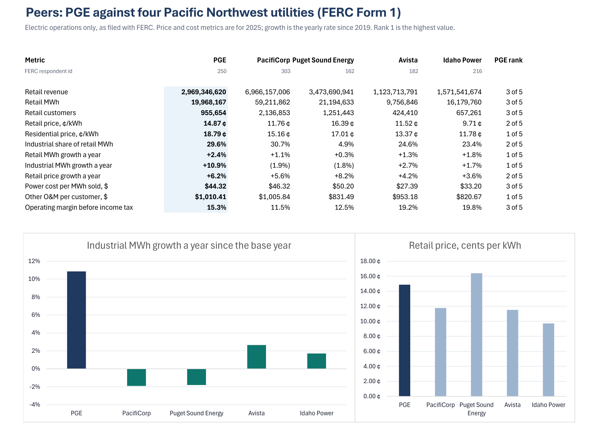
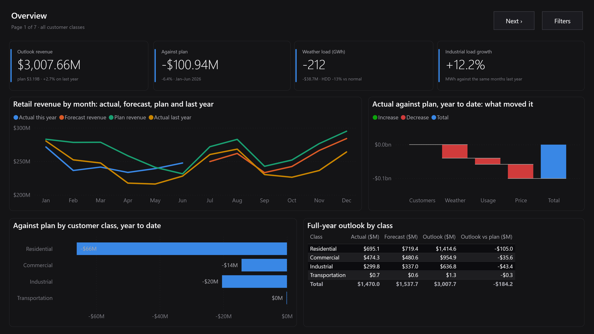
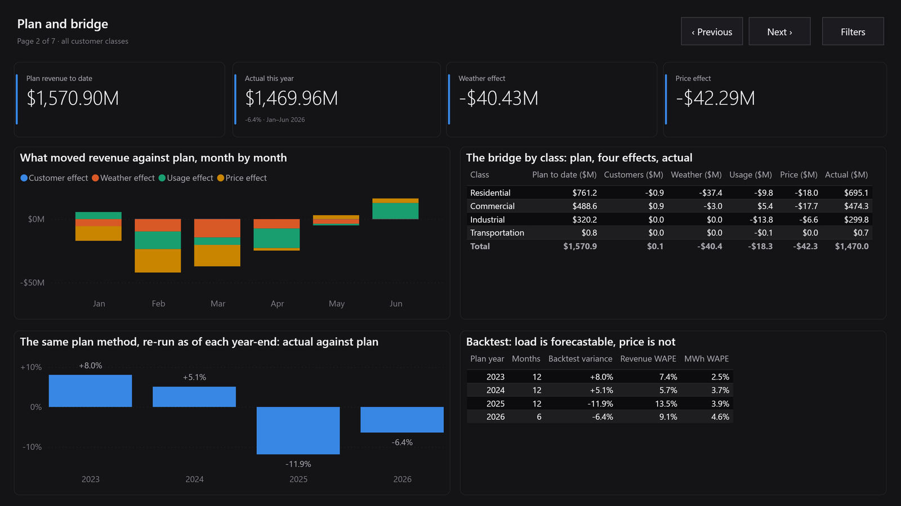
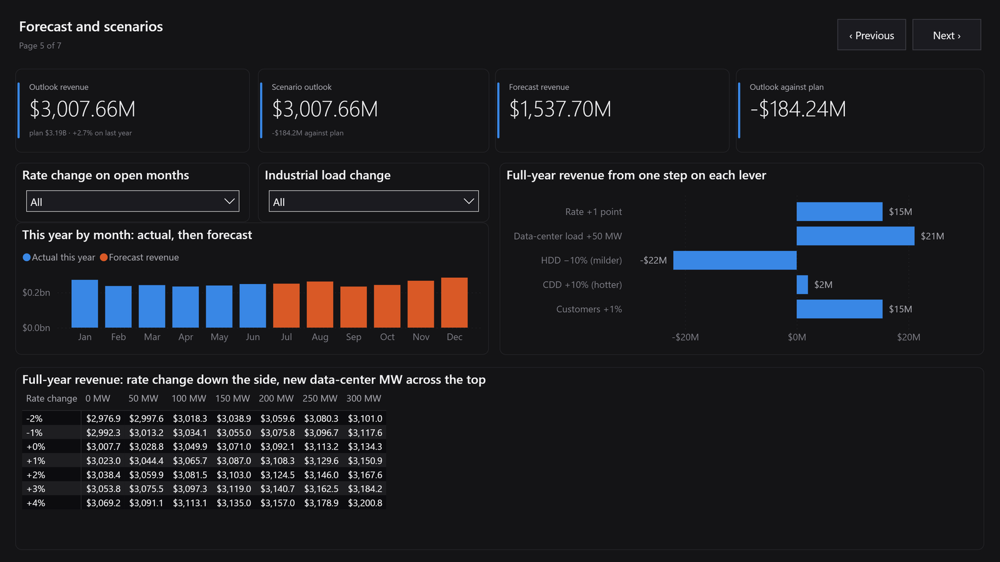
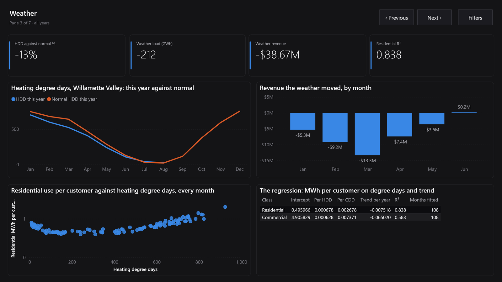
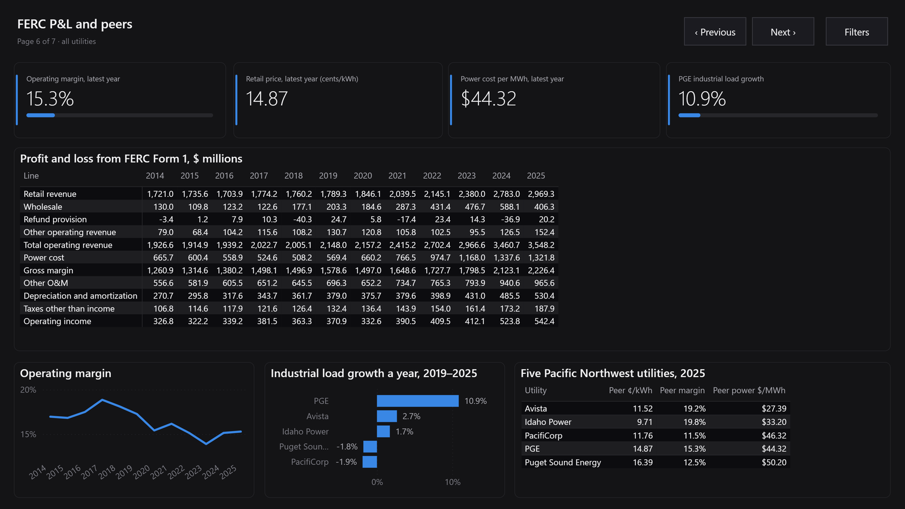
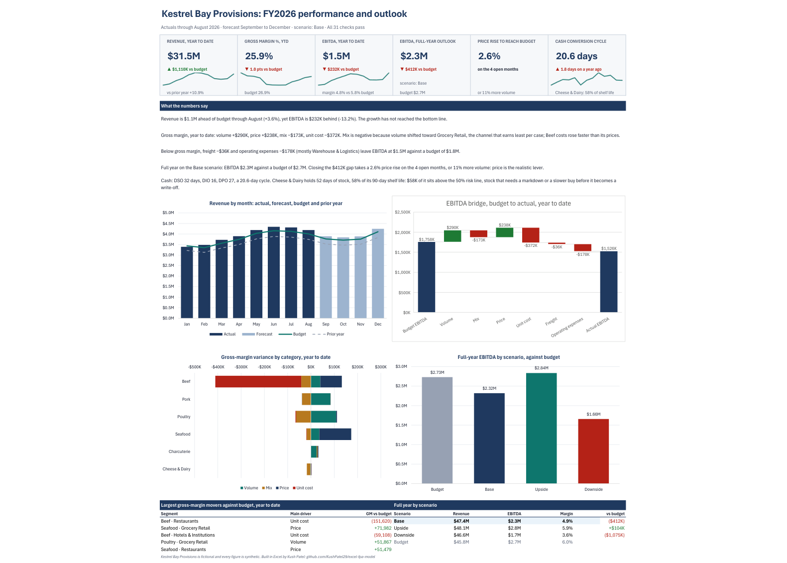

# Portland General Electric: a utility FP&A model in Excel and Power BI, on public data

[](https://github.com/KushPatel29/excel-fpa-model/actions/workflows/ci.yml)


This is an FP&A workbook for Oregon's largest electric utility, built from the filings a real
utility FP&A team works with:
- **EIA-861M**: monthly retail sales by customer class.
- **FERC Form 1**: the audited annual report every major US utility files with its federal regulator.
- **NOAA degree days**: heating and cooling degree days for the service territory.

It covers:
- a twelve-year P&L;
- a price-volume-mix bridge;
- a weather-normalization regression;
- a plan built only from data available at the prior year-end, with a variance bridge and a four-year backtest;
- a rolling forecast, scenarios and a tornado;
- a peer benchmark against four Pacific Northwest utilities.

It is built in Excel with Power Query, a Power Pivot data model with DAX measures, `LINEST`,
dynamic arrays, named LAMBDA functions and what-if data tables.

Every number is a live formula over the source extracts; nothing is pasted in. An
independent pandas model holds the saved workbook to the cent.

The same analysis is also a seven-page **Power BI report** (a PBIP project with a TMDL model).
It reads tables written by that same reference model, and a test reads the workbook's own cells
against them, so the two cannot publish different numbers. 1,183 tests in all.

**[Download the workbook](workbook/PGE_Utility_FPA_Model.xlsx)** (Microsoft 365 Excel) ·
**[Board pack PDF](docs/board_pack.pdf)** (13 pages, exported by Excel) ·
**[Power BI project](powerbi/pbip/)** ([how to open it](powerbi/pbip/OPEN_ME_FIRST.md))

> Independent analysis of public regulatory data. Not affiliated with or endorsed by Portland
> General Electric.


## What the model found

Actuals run through June 2026 (EIA) and the 2025 FERC filing.

**1. The first half of 2026 came in $100.9M (6.4%) under plan.** Retail revenue was $1,470.0M
against a plan of $1,570.9M. The plan was built only from data through December 2025. The
variance bridge splits the gap exactly:

| Effect | $ | What drove it |
|---|---:|---|
| Weather | **−$40.4M** | a mild winter: heating degree days 13% below the ten-year normal |
| Price | **−$42.3M** | the plan grew every class's price at 2025's rate; 2026 rates did not follow |
| Usage | −$18.3M | weather-adjusted use per customer, and industrial volume |
| Customers | +$79K | customer counts landed almost exactly on plan |

**2. Weather is measurable.** A `LINEST` regression of monthly MWh per customer on degree days
and a time trend explains 84% of residential variation (R² 0.838, 108 months). Against normal
weather, the mild first half cost **212 GWh and $38.7M** of retail revenue.

**3. The average price hides the class story.** Every customer class paid more per kWh than a
year earlier (+0.8% to +2.9%), yet the average retail price rose only 0.2%. The reason is mix.
Industrial load grew 12.2%, and it is billed at 9.4¢ against 18.9¢ for residential.

**4. The long view is price, not volume.** From 2019 to 2025, FERC-reported retail revenue rose
$1.18B:

| Price | Volume | Mix |
|---:|---:|---:|
| **+$993.6M** | +$275.4M | −$89.0M |

Industrial MWh grew 10.9% a year, the fastest of the five peers. Power costs grew faster than
revenue, and operating margin fell 2.0 points to 15.3%.

**5. Where 2026 lands.** On normal weather for the open months, full-year retail revenue is
**$3.01B, +2.7% on 2025 and $184.2M under plan**. One point of rate on the open months is worth
$15.4M. Fifty megawatts of new data-center load is worth $21.1M. A mild autumn would cost $26.5M.

**6. What the backtest teaches.** The same plan method, re-run as of each of the last four
year-ends (one Excel data table over the plan year), gave these results:

| Plan year | Actual vs plan | Revenue WAPE | MWh WAPE |
|---|---:|---:|---:|
| 2023 | +8.0% | 7.4% | 2.5% |
| 2024 | +5.1% | 5.7% | 3.7% |
| 2025 | −11.9% | 13.5% | 3.9% |
| 2026 (Jan–Jun) | −6.4% | 9.1% | 4.6% |

Volume is forecastable from history within about 4%. Price is not, because it moves with rate
cases. A real plan should take price from the rate-case calendar, not from trend.

The Dashboard writes points 1 to 5 itself. The summary is a set of formulas (`LET`, named `MONEY`
and `SIGNMONEY` LAMBDAs), so changing the scenario or the as-of month rewrites the sentences. A
test holds each sentence to the reference model.

## What's in the workbook

| Sheet | What it answers | Excel on show |
|---|---|---|
| **Cover** | Five questions answered live, sources and licences, sheet guide | Formula-driven answers, hyperlinks |
| **Dashboard** | One page for a CFO: KPIs, written summary, bridges, outlook | Waterfall and combo charts, sparklines, `LET` |
| **PnL** | Twelve years of the FERC Form 1 income statement, with unit economics | `SUMIFS` over tables, CAGR and variance columns |
| **PVM** | Price, volume and mix by customer class: long view, last year, year to date | A three-effect decomposition that is exact in every class |
| **Monthly** | EIA monthly sales, year to date, and how EIA ties to FERC | Revenue grid, reconciliation between two federal sources |
| **Weather** | How much of the load is the thermostat | `LINEST` inside `LET`/`HSTACK`/`FILTER`, normals, weather impact |
| **Plan** | A plan from prior-year data, the variance bridge, a four-year backtest | `EDATE`, the plan regression, a one-variable data table over the plan year |
| **Forecast** | Actuals plus forecast for the open months, by class | `XLOOKUP`, `FORECAST.ETS` as a statistical cross-check |
| **Scenarios** | Weather scenario, rate and data-center levers, tornado | Seven what-if data tables (one- and two-variable), `SORTBY`, validation |
| **Peers** | PGE against PacifiCorp, Puget Sound Energy, Avista and Idaho Power | `RANK.EQ` on twelve FERC metrics |
| **Explore** | The data model, sliced | Power Pivot + DAX (`TREATAS` year on year), PivotTable, slicers, `CUBEVALUE` |
| **Checks** | 31 controls that prove the model ties out | Reconciliations, each with a stated tolerance |
| **Assumptions** | Every input in one place | Named inputs, blue-on-yellow input convention |
| **PQ_\*** | EIA unpivoted and reshaped; NOAA's fixed-width text parsed | Power Query (M): unpivot/pivot, `Splitter.SplitTextByPositions` |
| **Data_\*** | The source extracts, loaded unchanged | Excel tables, structured references |

<table>
<tr><td></td><td></td></tr>
<tr><td></td><td></td></tr>
<tr><td></td><td></td></tr>
</table>

## The same numbers in Power BI

The Power BI report answers the workbook's questions for someone who wants to click rather
than scroll. It has seven pages:

1. Overview
2. Plan and bridge
3. Weather
4. Price, volume and mix
5. Forecast and scenarios
6. FERC P&L and peers
7. EIA against FERC

The report adds:
- class slicers;
- a filter panel on every page;
- two what-if sliders: a rate change, and an industrial load change in MW (a data center arriving
  or a plant closing).



<table>
<tr><td></td><td></td></tr>
<tr><td></td><td></td></tr>
</table>

**Two surfaces, one definition.** The report's model does no analysis of its own.
[`model/export_tables.py`](model/export_tables.py) writes the reference model's output to
[`tables/`](tables/), and every measure in [`powerbi/model_spec.py`](powerbi/model_spec.py) sums
a column or divides two sums.
[`tests/test_powerbi_tables.py`](tests/test_powerbi_tables.py) then reads the Excel workbook's
cached cells against those tables to the cent. It covers:
- the plan, the bridge by class and in total;
- the outlook, the weather impact and the `LINEST` coefficients;
- the tornado, the sensitivity grid and the backtest;
- the PVM, the FERC P&L and the reconciliation.

**The one calculation the report does itself** is the scenario outlook behind the sliders. The
test replays that measure's DAX in pandas and holds it to the 49-cell sensitivity grid, which
the reference model computed by re-running the whole forecast. It was also checked inside Power
BI Desktop: +1% rate and +50 MW gives $3,044,353,720.98, the grid's cell to the cent.

**Generated, not hand-drawn.** [`powerbi/build_pbip.py`](powerbi/build_pbip.py) writes every
visual's JSON and every TMDL table from the two spec files, and CI fails if the committed project
drifts from the spec. The report was opened in Power BI Desktop, fully refreshed, row-counted
table by table against the CSVs, and captured page by page. Microsoft's report validator
(`powerbi-report-author validate`) found 0 errors and 0 warnings. The screenshots above are those
captures.

## A second Excel model in this repository

[`examples/kestrel-bay/`](examples/kestrel-bay/) keeps the model this repository started with. It is
an FP&A workbook for a **synthetic** BC food distributor, and it shows a different side of the job:
- budget against actual, with a price-volume-mix bridge exact in each of 24 segments;
- an 8+4 driver forecast and scenarios;
- working capital down to stock held past half its shelf life;
- channel economics computed twice, by formulas and by the Power Pivot data model.

Its build code and 182 tests are preserved at the tag
[`kestrel-bay-v1`](https://github.com/KushPatel29/excel-fpa-model/tree/kestrel-bay-v1), and a test
here pins the kept workbook to the tagged, tested file.

[](examples/kestrel-bay/)

## The data

| Source | What | Licence |
|---|---|---|
| [EIA-861M](https://www.eia.gov/electricity/data/eia861m/) | PGE (EIA utility 15248, Oregon): revenue, MWh and customers by class, monthly from January 2017 | US government work, public domain |
| [FERC Form 1](https://www.ferc.gov/general-information-0/electric-industry-forms/form-1-electric-utility-annual-report) via [Catalyst Cooperative's PUDL](https://catalyst.coop/pudl/) (release v2026.9.0) | Revenue by class, operating expenses and the income statement, 2014–2025, for PGE and four peers | CC BY 4.0 |
| [NOAA NCEI nClimDiv](https://www.ncei.noaa.gov/pub/data/cirs/climdiv/) | Oregon climate division 2 (the Willamette Valley): heating and cooling degree days, base 65°F | US government work, public domain |

[`pipeline/fetch_sources.py`](pipeline/fetch_sources.py) downloads the sources and writes the
extracts in [`data/`](data/). [`data/sources.json`](data/sources.json) records every URL, the
retrieval time and each download's SHA-256. The extracts are committed, so the workbook, the
reference model and the tests never touch the network. EIA marks its latest months as
preliminary and revises them, so a later run can produce slightly different numbers.

## How the pieces fit

```
data/ (EIA · FERC · NOAA) ─► Excel tables (Data_*) ─┬─► Power Query ─► Monthly (class × month), Weather (degree days)
                                                    │                     │
                                                    │                     ├─► Power Pivot data model ─► PivotTable, slicers, CUBEVALUE
                                                    │                     │   (4 tables, 3 relationships, 11 DAX measures)
                                                    │                     │
                                                    └─► SUMIFS / LINEST ──┴─► PnL · PVM · Weather · Plan · Forecast · Peers
                                                                                        │
                                                                             Scenarios (data tables) ─► Checks ─► Dashboard · Cover
```

**The plan** is what an FP&A team could have written at the prior year-end, using only data up
to December:
- customers grow at last year's rate;
- residential and commercial use per customer comes from a weather regression at normal weather;
- industrial volume and every class's price grow at last year's rate.

**The variance bridge** splits actual minus plan exactly, in every class and month:
- **customers**: (actual − plan customers) × plan use × plan price;
- **weather**: actual customers × the weather effect × plan price;
- **usage**: the rest of the volume difference, at plan price;
- **price**: actual MWh × the price difference.

**Price-volume-mix** values each class's change in MWh twice:
- at the earlier period's average price, which gives **volume**;
- at the class's own price minus that average, which gives **mix**.

**Price** is the change in $/MWh on the later period's MWh. The three effects add up to each
class's revenue change, not just to the total.

## How it's verified

- **An independent twin.** [`model/reference.py`](model/reference.py) recomputes every published
  figure in pandas from the same extracts, without reading the workbook.
  [`tests/test_workbook_ties_out.py`](tests/test_workbook_ties_out.py) reads the saved workbook's
  cached values through defined names, so no test depends on a cell address. It holds each figure
  to the twin, including:
  - every P&L line in all twelve years and every PVM row;
  - the `LINEST` coefficients, the normals and the weather impact;
  - the plan, the bridge and the backtest;
  - the forecast and the outlook;
  - the scenario tables, all 49 cells of the sensitivity grid and the tornado;
  - the peer ranks and the cube formulas.
- **Two federal sources, reconciled.** EIA's monthly MWh add up to within 0.1% of what PGE
  reported to FERC, every year from 2017. EIA's revenue runs 1.1% to 2.5% below FERC's, because
  EIA reports billed revenue and FERC booked revenue. The workbook shows the gap and checks it
  stays within 3%.
- **31 in-workbook checks.** They cover:
  - load controls against source row and value totals;
  - Power Query row counts;
  - P&L identities and bridge closure;
  - the data tables against the live model.

  Tests fail if any check fails, or if any cell holds an error value.
- **No hard-coded numbers.** A test walks every calculation sheet and fails on any typed number,
  apart from the declared inputs and the data tables' axes.
- **The techniques are really there.** Feature tests open the `.xlsx` package itself. They check:
  - the Power Query M code, unpacked from the DataMashup part;
  - the data model binary;
  - the OLAP pivot cache and its measures, and the slicer caches;
  - the four waterfall chart parts;
  - all eight `dataTable` formulas;
  - the six named LAMBDAs.
- **The tests can fail.** Shortening the reference model's normal-weather window from ten years
  to nine turns 13 tie-out tests red.

### What the checks caught while building it

- **A peer's classes did not add up.** Avista's FERC revenue classes fall $1.2M–$2.2M a year
  short of its own "sales to ultimate consumers" line. The difference is a class this extract
  does not carry. PGE's classes add up to the dollar. The peer metrics read FERC's subtotal, and
  the data test holds peers to 0.5%.
- **Two FERC schedules differ by $5.** PGE's O&M expense schedule and its income statement
  disagree by a rounding amount. The check states a $100 tolerance and says why, rather than
  pretending they match.
- **A download that was not a file.** EIA answers a request for a missing workbook with HTTP 200
  and an HTML page. The pipeline checks for the zip signature, and a missing year fails loudly
  instead of loading a web page as data.
- **A plan that looked accurate.** Volume WAPE of 2.5–4.6% looked good until the backtest showed
  revenue misses of up to 13.5%. The misses came from price, not load, and point 6 above
  reports them rather than hiding them.

## Build it yourself

```bash
pip install -r requirements.txt
python model/reference.py             # the pandas twin: bridge, PVM, weather, outlook
python -m pytest                      # any OS: holds the committed workbook to the twin
```

To refresh the data from the sources (needs network, and `pyarrow` for PUDL's parquet files):

```bash
pip install -r requirements-pipeline.txt
python pipeline/fetch_sources.py
```

The Power BI project regenerates on any OS:

```bash
python model/export_tables.py         # tables/: the reference model's output, for the report
python -m powerbi.build_pbip          # powerbi/pbip/, from powerbi/model_spec.py and report_spec.py
```

Rebuilding the workbook needs Windows with Microsoft 365 Excel and `pywin32`. It takes about a
minute and also exports the board pack:

```bash
python model/build_workbook.py        # workbook/PGE_Utility_FPA_Model.xlsx + docs/board_pack.pdf
python model/render_previews.py       # docs/img/*.png from the PDF (needs pymupdf, pillow)
```

The builder drives Excel over COM in a private Excel process, so an Excel window you already have
open is left alone. Python only lays the workbook out; the arithmetic is Excel's (formulas,
Power Query, DAX, `LINEST` and data tables).

## Using the workbook

1. **Pick a weather scenario** for the open months in `Scenarios!C4`. Every sheet, chart and
   sentence follows.
2. **Test your own view** with the rate, data-center MW, customer and degree-day levers in
   `Scenarios!C5:C9`.
3. **Re-run the plan as of an earlier year-end** with `Plan!C4`.
4. **Explore the data model** with the slicers on `Explore`.

## Repository layout

```
pipeline/fetch_sources.py    downloads EIA, FERC (PUDL) and NOAA; writes data/ and sources.json
data/                        the extracts the workbook is built from
model/reference.py           independent pandas recomputation of every figure
model/build_*.py, xl.py      the COM builder: setup, calculation, plan, analysis, views
model/layout.py              names and positions shared by the builder and the tests
workbook/                    PGE_Utility_FPA_Model.xlsx
docs/                        board_pack.pdf and the README images
model/export_tables.py       the reference model's output as tables for Power BI
examples/kestrel-bay/        the earlier synthetic-distributor workbook (code at tag kestrel-bay-v1)
tables/                      those tables, committed
powerbi/                     the PBIP generator, its model and report specs, and the project
tests/                       1,183 tests: workbook tie-out and features, data, Power BI model,
                             report and cross-surface tie-out, badge
```

## Limits

- This is an outside-in view from public filings. It has no access to PGE's internal budget,
  rate-case filings or meter data. "Plan" means the plan this method would have produced, not
  PGE's own.
- EIA's 2026 months are preliminary.
- CI cannot run Excel. It verifies the committed workbook's cached values and the committed
  extracts, but it cannot rebuild the workbook.
- The workbook's DAX measures live inside the data model's binary. They are verified through what
  they produce (the PivotTable cache and the `CUBEVALUE` results), not by reading their text.
- CI cannot run Power BI either. It regenerates the project and checks it against the spec, the
  schemas and the tables, but it cannot render a visual. The rendering was checked in Desktop, not
  in CI.
- The Power BI project is not published to the Power BI service, which needs a work account and
  a licence. It opens in the free Power BI Desktop.

## License

Code under MIT. The FERC Form 1 data is from Catalyst Cooperative's PUDL under CC BY 4.0. EIA and
NOAA data are US government works in the public domain. Portland General Electric's name is used
only to identify the public filings analysed; this project is not affiliated with or endorsed by
the company.
