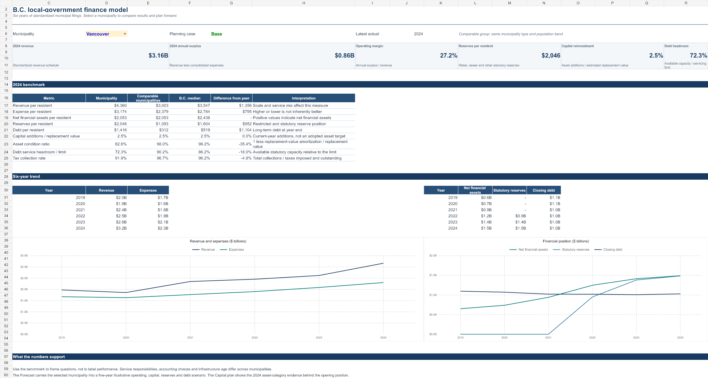
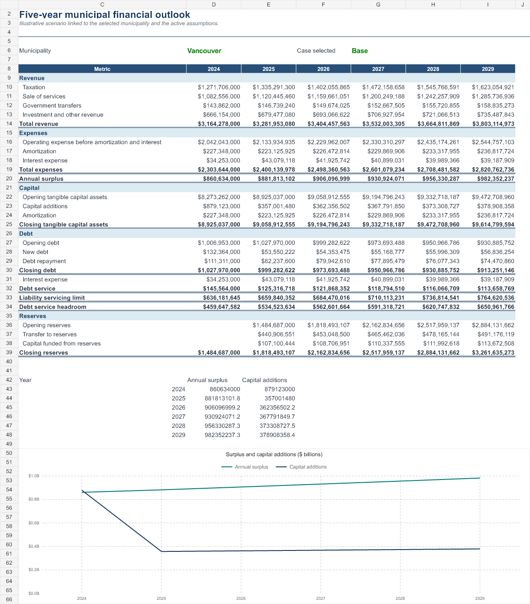
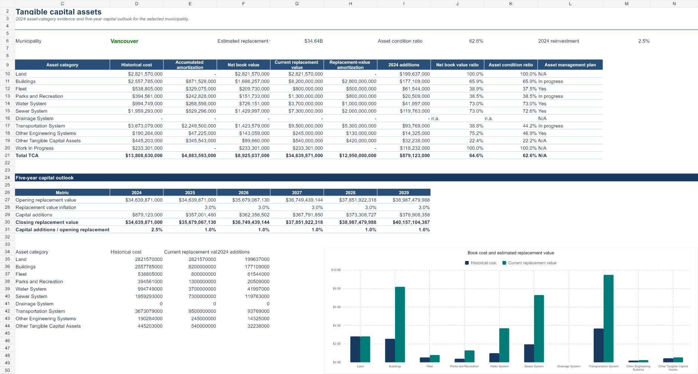

# B.C. local-government finance model

An interactive Excel model built from six years of official Province of British Columbia municipal filings. It turns 66 source workbooks across 11 schedules into a comparable financial history for 161 municipalities, a 2024 asset-category view, and a five-year scenario plan.

**[Download the workbook](BC_Local_Government_Finance_Model.xlsx)**



## What it answers

- How did a municipality perform from 2019 to 2024, and how does it compare with municipalities of the same type and population band?
- How do revenue, expenses, capital additions, debt-service capacity and reserves change under Base, Upside and Downside assumptions?
- Which asset categories carry the largest replacement exposure, and how does the illustrative capital program compare with that base?

The workbook includes `Dashboard`, `Forecast`, `Capital plan`, `Assumptions`, `Checks`, `Municipal data`, `Asset data`, and `ReadMe` sheets. Its selector covers all 161 municipalities in the 2024 filing set. The history contains 968 municipality-year records: 161 continuous 2019–2024 histories plus Jumbo Glacier for 2019–2020 before dissolution. The 2024 asset table contains 1,932 municipality-category records.

## Model controls

- Revenue components reconcile to total revenue for every record.
- Expense components reconcile to total expenses for every record.
- 2024 asset categories reconcile to each municipality's `Total TCA` row.
- Forecast debt, tangible-capital-asset and reserve balances roll forward exactly.
- Source headers and asset-category labels are contracted; unexpected structural drift fails extraction.
- Queen Charlotte is aligned to Daajing Giids, Sechelt Indian Government is aligned to shíshálh Nation Government District, Mission's type change is normalized, and the Vancouver footnote digit is removed.

The asset condition ratio is an accounting proxy: `1 - replacement-value amortization / estimated current replacement value`. It is not an engineering condition assessment. The forecast is illustrative and is not an adopted budget, tax-rate bylaw or debt authorization.

## Reproduce the data layer

```powershell
python pipeline/fetch_sources.py
python pipeline/extract.py
```

`fetch_sources.py` downloads the exact 66 official `.xlsx` files and writes their URLs, sizes and SHA-256 hashes to `data/source_manifest.json`. The normalized CSVs are committed so the workbook and automated tests do not require network access.

Source: [Province of British Columbia, Municipal general and financial statistics](https://www2.gov.bc.ca/gov/content/governments/local-governments/facts-framework/statistics/statistics), schedules 201, 301, 302, 304, 401, 402, 502, 503, 601.1, 602.1 and 706 for 2019–2024. The Province reviews submitted data but does not guarantee its accuracy or validity; material figures should be confirmed with the relevant local government.

<table>
<tr><td></td><td></td></tr>
</table>
